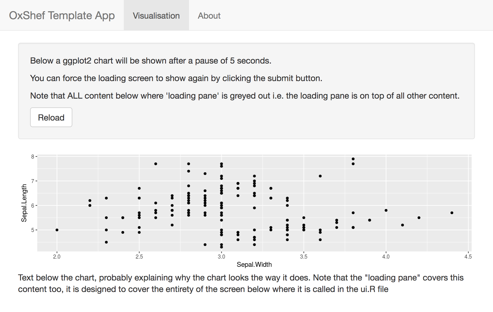

```{r setup, include=FALSE}
knitr::opts_chunk$set(
	echo = TRUE,
	message = FALSE,
	warning = FALSE
)
```

# Shiny Templates

These templates are designed to provide a structured approach to designing scalable and reproducible Shiny apps.

### Basic Templates


<div class="row">
   <div class="col-md-6">
   <span><a href="templates_barcharts.html">The navbarPage template</a> is very flexible as it provides a horizontal navigation menu at the top of the app for splitting your visualisations into sections and to add an "about" page. It is highly recommended you use a derivative of this template for publishing to the University of Oxford's IDN as it makes supporting [converting your app to static images](idn_info.html#static-image) simple.</span>
   <br>
   <strong>Required Data:</strong>
   <ul>
   <li>Categories: For instance, class of animal e.g. mammal or reptile</li>
   <li>Values: For instance, number of animals of each class</li>
   </ul>
   </div>
   <div class="col-md-5 vcenter">
```{r echo=FALSE, out.width = "450px"}

```
   </div>
   </div>
   <br>
