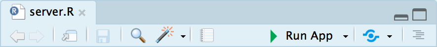

```{r setup, include=FALSE}
knitr::opts_chunk$set(
	echo = TRUE,
	message = FALSE,
	warning = FALSE
)
```

# What does this tutorial achieve?

This tutorial is explicitly and exclusively focused on making a very simple Shiny app that will work on your local computer (the computer you're typing your code into). [Learn how to deploy Shiny apps to the web here](deploy.html).

# Things you must know

In order to effectively build Shiny apps you **must** be careful about your directory (folder) structure and what lives in each of your code files; it is very important that Shiny apps should live in separate folders to one another. 

It's highly recommended that you use RStudio Projects to make your life easier and help write reproducible code (and Shiny apps) [here's an video overview of the benefits of using RStudio Projects]( https://www.linkedin.com/learning/learning-the-r-tidyverse/why-should-you-use-projects-in-rstudio).

# Our Example App

<div class="row">

<div class="col-md-5">

Our example Shiny app is extremely simple and is embedded into this page. It contains two elements:

- A pulldown menu which in Shiny speak is called a "selectInput" and under the hood is actually a [selectize.js textbox](https://selectize.github.io/selectize.js/)
- A plot of the function x^n, where is the value selected from the pulldown menu

The code for this Shiny app is on [the Github repo](https://github.com/OxShef/oxshef_shiny/tree/master/tutorial-apps/shiny101) and the Shiny app is embedded into this page using a simple iframe, [see here for more details](deploy_shinyapps-io.html). 

</div>

<div class="col-md-7">

<iframe src="https://trainingidn.shinyapps.io/OxShef_shiny_tutorials_shiny101/" width="100%" height="400px"></iframe>

</div>

</div>

# Building our Shiny app

All of the gubbins (stuff) needed to make Shiny apps work on your machine is provided by the R package `shiny`, which is installed from CRAN using `install.packages("shiny")`.

Shiny apps require<sup id="a1">[1](#two-file-apps)</sup> two files in the Shiny app folder:

- `ui.R`: This is where the "look and feel" of a Shiny app is defined, what is displayed to the user. It is also sometimes called the "client-side" part of the Shiny app
- `server.R`: This is where the work of the Shiny app is done, where R code is evaluated and output is generated that is then sent to the `ui.R` file to be displayed to the user.

Create the two files described below in a folder and open either ui.R or server.R in RStudio, the "Run App" button shown below will be displayed - clicking this will "run" the Shiny app on your local machine and you will be able to interact with it.

```{r, out.width="500px", echo=FALSE}

```


## ui.R

Here's the code for our `ui.R` file:

```{r, eval=FALSE}
fluidPage(
  selectInput("exponent", label = "Exponent (i.e. x^n)", choices = 1:5),
  plotOutput("curvePlot")
)
```

Let's split our explanation of the file into the three functions used:

- fluidPage
- selectInput
- plotOutput

### fluidPage

There are number of different types of "pages" that can be created with Shiny; `fluidPage`, `navbarPage` are two of the most popular. The former, `fluidPage`, allows us to design a Shiny app that *should* display nicely on mobile and desktop browsers. The function is provided a sequence of arguments which are shown underneath one another.

### selectInput

`selectInput(inputId, label, choices)` specifies a pulldown menu (more properly called a selectize menu) with a `label` and restricted to the `choices` specified. The `inputId` argument is the "input variable" that is communicated backwards and forwards between `ui.R` and `server.R` while the Shiny app is running.

In this specific instance, there is a variable we can access in the `server.R` file: `input$exponent`. 

It is important to remember that even though our choices are *integers*, on the server-side (i.e. in the `server.R` file) the input will be converted to characters. 

```{r, eval=FALSE}
class(input$exponent)
```

```{r, echo=FALSE}
class("1")
```

### plotOutput

`plotOutput` is designed to receive content from the `server.R` file generated with the `renderPlot` function and added to the `output` object, in this case `"curvePlot"`. There are lots of different types of content you can generate in `server.R` to display in `ui.R` and this always achieved with a pair of `*Output` and `render*` functions.

## server.R

Here's the code for our `server.R` file:

```{r, eval=FALSE}
function(input, output){

  output$curvePlot <- renderPlot({
    print(input$exponent)
    curve(x^as.numeric(input$exponent),
          from = -3,
          to = 3,
          main = paste0("Plot of x^", input$exponent),
          ylab = "y")
  })

}
```

Let's split our explanation of the file into the three sections

- function(input, output)
- renderPlot
- print(input$exponent)

### function(input, output)

Data is transferred backwards and forwards between the `ui` and `server` components of the Shiny app via the `input` and `output` objects in this function within the `server.R` file.

The `input` object is composed of all the `inputIds` for your controls (i.e. `selectInput`) as well as [inputs created by htmlwidgets in Shiny apps](tutorials_shiny-htmlwidgets.html). These values can **only** be accessed in the `server.R` file, it is not possbb                                                                                                                                                                                                                                                                                                                                                                                                                                                                                                                                                                                                                                                                                                                                                                                                                                                                                                                                                                                                                                                                                                                                                                                                                                                                                                                                                                                                                            


# Technical Notes

<span id="two-file-apps"><b>1</b></span> Technically it is possible to build Shiny apps within a single file called app.R, however it is highly recommended that you split your Shiny app into two files because a single file quickly becomes unwieldy for even moderately "simple" Shiny apps.